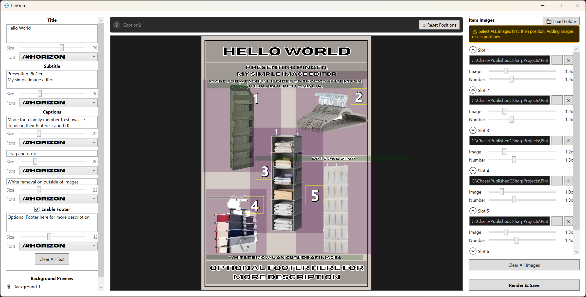
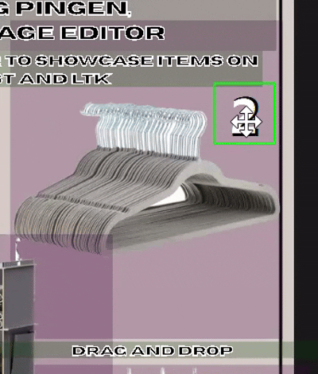
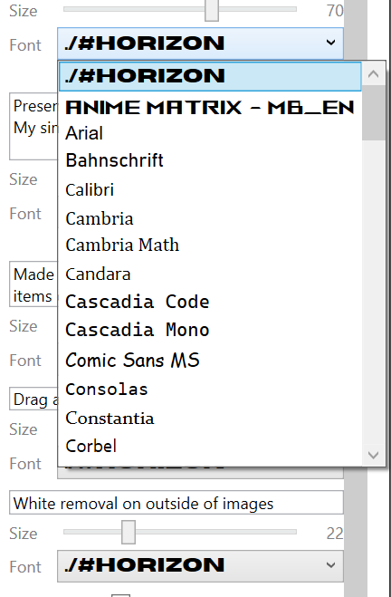
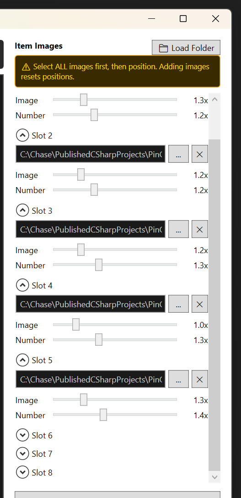
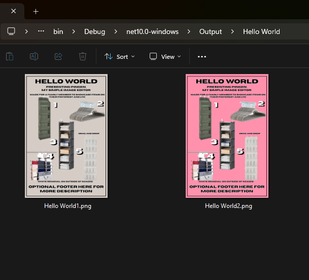
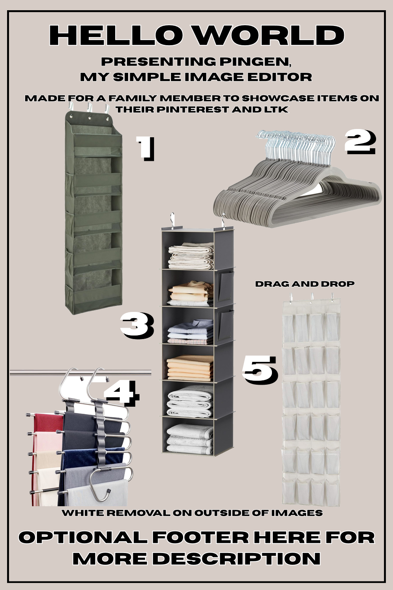

# PinGen

PinGen is a WPF application I developed to help some family members of mine solve a simple problem of not being able to create certain images faster. They are given items and a theme by companies and they need to create a collage of those items into an image to work as an advertisement where when users click it, it funnels them to the Amazon listing or the manufacturer's website, etc. They found Photoshop to be too cumbersome to have to load constantly and wanted something more simple since the images don't have to be so grand. My editor can hold up to 8 item images, 3 captions, title, sub title and optional footer. Everything can be drag and dropped, and have the size/scale change. I'm really not sure if I will ever add more to this as they are content with it, but maybe one day just to keep up with WPF and MVVM practices.

